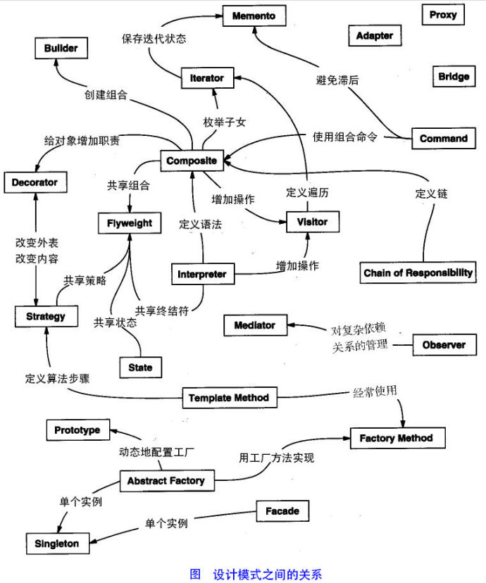

# 23种设计模式

## 一、设计模式的类别

总体来说设计模式分为三大类： 创建型模式，共五种：工厂方法模式、抽象工厂模式、单例模式、建造者模式、原型模式。 结构型模式，共七种：适配器模式、装饰器模式、代理模式、外观（门面）模式、组合模式 、桥接模式、享元模式。 行为型模式，共十一种：策略模式、模板方法模式、观察者模式、迭代子模式、命令模式、状态模式、备忘录模式、 访问者模式、中介者模式、责任链模式、 解释器模式。

1. 简单工厂模式（Simple Factory Pattern）
2. 工厂方法模式（Factory Method Pattern）
3. 抽象工厂模式（Abstract Factory Pattern）
4. 建造者模式（Builder Pattern）生成器模式
5. 原型模式（Prototype Pattern）
6. 单例模式（Singleton Pattern）
7. 适配器模式（Adapter Pattern）
8. 桥梁模式（Bridge Pattern）桥接模式
9. 组合模式（Composite Pattern）
10. 装饰模式（Decorator Pattern）
11. 门面模式（Facade Pattern）外观模式
12. 享元模式（Flyweight Pattern） 蝇量模式
13. 代理模式（Proxy pattern）
14. 责任链模式（Chain of Responsibility Pattern）
15. 命令模式（Command Pattern）
16. 解释器模式（Interpreter Pattern）
17. 迭代器模式（Iterator Pattern）
18. 中介者模式 \(Mediator Pattern\)
19. 备忘录模式（Memento Pattern）
20. 观察者模式（Observer Pattern）
21. 状态模式（State Pattern）
22. 策略模式（Strategy Pattern）
23. 模板方法模式（Template Method Pattern）
24. 访问者模式（Visitor Pattern）

## 二、设计模式的六大原则

1. 开闭原则（Open Close Principle）

   开闭原则就是说对扩展开放，对修改关闭。在程序需要进行拓展的时候，不能去修改原有的代码，实现一个热插拔的效果。所以一句话概括就是：为了使程序的扩展性好，易于维护和升级。想要达到这样的效果，我们需要使用接口和抽象类，后面的具体设计中我们会提到这点。

2. 里氏代换原则（Liskov Substitution Principle）

   里氏代换原则\(Liskov Substitution Principle LSP\)面向对象设计的基本原则之一。 里氏代换原则中说，任何基类可以出现的地方，子类一定可以出现。 LSP是继承复用的基石，只有当衍生类可以替换掉基类，软件单位的功能不受到影响时，基类才能真正被复用，而衍生类也能够在基类的基础上增加新的行为。里氏代换原则是对“开-闭”原则的补充。实现“开-闭”原则的关键步骤就是抽象化。而基类与子类的继承关系就是抽象化的具体实现，所以里氏代换原则是对实现抽象化的具体步骤的规范。—— From Baidu 百科

3. 依赖倒转原则（Dependence Inversion Principle）

   这个是开闭原则的基础，具体内容：真对接口编程，依赖于抽象而不依赖于具体。

   [http://blog.csdn.net/lonelyroamer/article/details/8204036](http://blog.csdn.net/lonelyroamer/article/details/8204036)

4. 接口隔离原则（Interface Segregation Principle）

   这个原则的意思是：使用多个隔离的接口，比使用单个接口要好。还是一个降低类之间的耦合度的意思，从这儿我们看出，其实设计模式就是一个软件的设计思想，从大型软件架构出发，为了升级和维护方便。所以上文中多次出现：降低依赖，降低耦合。

5. 迪米特法则（最少知道原则）（Demeter Principle）

   为什么叫最少知道原则，就是说：一个实体应当尽量少的与其他实体之间发生相互作用，使得系统功能模块相对独立。

6. 合成复用原则（Composite Reuse Principle）

   原则是尽量使用合成/聚合的方式，而不是使用继承。

7. 单一职责原则

   单一职责原则的英文名称是 Single Responsibility Principle，简称是 SPR，简单地说就是一个类只做一件事，这个设计原则备受争议却又极其重要。只要你想和别人争执、怄气或者是吵架，这个原则是屡试不爽的。因为单一职责的划分界限并不是如马路上的行车道那么清晰，很多时候都是需要个人经验来界定。当然，最大的问题就是对职责的定义，什么是类的职责，以及怎么划分类的职责。

